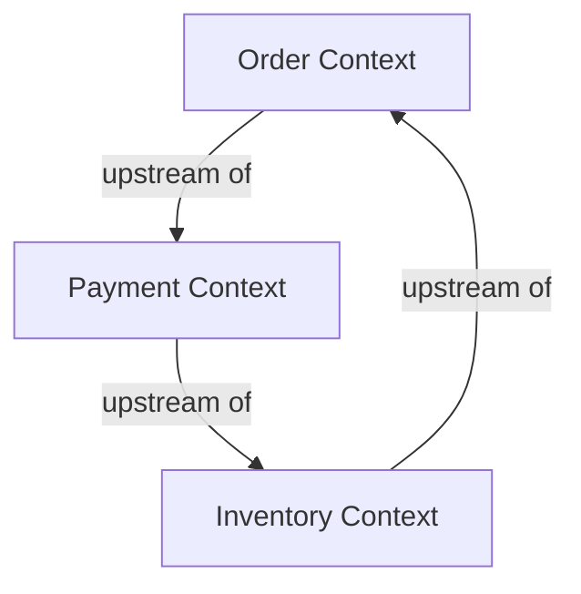
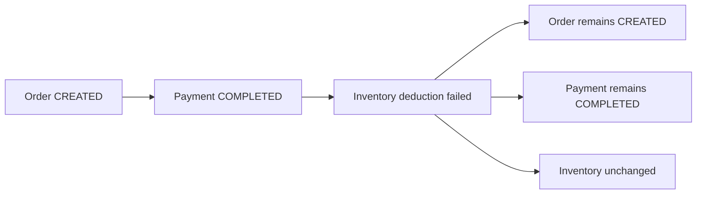

# Step 2a Event Storming / Context Map

이 문서는 Step 2a에서 서비스들이 어떤 경계로 나뉘고, 어떤 이벤트로 연결되는지를 빠르게 판단하기 위한 문서다.

---

## 1. Context Map

### 컨텍스트 정의

- `Order Context`
  - 주문 생성과 주문 확정을 책임진다.
  - 외부 Client가 직접 진입하는 유일한 컨텍스트다.
- `Payment Context`
  - 결제 사실을 기록한다.
  - 주문 생성 이후의 두 번째 단계다.
- `Inventory Context`
  - 실제 재고 차감 성공 여부를 판정한다.
  - Step 2a 순방향 플로우의 마지막 성공 조건을 가진다.

### 관계도 해석

Step 2a의 context map은 "어떤 순서로 호출되느냐"보다 "누가 누구의 상태 변화를 트리거하느냐"를 보는 것이 중요하다.

- `Order Context -> Payment Context`
  - `Order Context`가 upstream이다.
  - `Payment Context`는 `OrderCreatedEvent`를 받아서만 일을 시작한다.
- `Payment Context -> Inventory Context`
  - `Payment Context`가 upstream이다.
  - `Inventory Context`는 `PaymentCompletedEvent`를 받아서만 일을 시작한다.
- `Inventory Context -> Order Context`
  - `Inventory Context`가 upstream이다.
  - `Order Context`는 `InventoryDeductedEvent`를 받아야만 주문을 확정할 수 있다.

즉, Step 2a는 세 컨텍스트가 원형 순서로 연결되지만, 각 연결은 모두 **"성공 이벤트를 발행한 쪽이 upstream"** 이다.

### 관계 규칙

| Upstream Context | Downstream Context | 관계의 의미 | 공유 계약 |
|---|---|---|---|
| Order | Payment | 주문이 생성돼야 결제가 시작될 수 있다 | `OrderCreatedEvent` |
| Payment | Inventory | 결제가 완료돼야 재고 차감이 시작될 수 있다 | `PaymentCompletedEvent` |
| Inventory | Order | 재고 차감이 완료돼야 주문 확정이 가능하다 | `InventoryDeductedEvent` |

### 통합 방식 해석

- 컨텍스트 간 직접 HTTP 의존은 없다.
- Downstream은 upstream 서비스 자체를 아는 것이 아니라, upstream이 발행한 이벤트 계약만 안다.
- Step 2a에서는 별도 번역 계층이나 anti-corruption layer를 두지 않는다.
- 즉, downstream은 upstream 이벤트 계약에 맞춰 반응하는 단순한 형태다.

한 줄로 줄이면:

`Step 2a의 컨텍스트 관계는 partnership가 아니라, upstream success event를 downstream이 받아 이어가는 단방향 연결의 연속이다.`

---

## 2. Failure Hotspots

Step 2a는 happy path만 구현한다. 그래서 실패는 아래 지점에서 멈춘다.

### 2.1 Payment 이후 Inventory 실패

이 지점이 가장 중요한 이유는:

- `payment-service`는 이미 성공 이벤트를 발행한 상태다
- `inventory-service` 실패를 되돌리는 이벤트가 아직 없다
- 그래서 시스템 전체 상태가 같은 방향으로 수렴하지 않는다

### 2.2 Order Context 관점의 문제

`order-service`는 `inventory-deducted`를 받아야만 확정할 수 있다.

- 이벤트가 오지 않으면 `CREATED`에 머문다
- Step 2a에는 timeout, retry, 보상 이벤트 정책이 없다

---

## 3. Step 2b로 넘기는 결정

아래는 Step 2a에서 일부러 잠그지 않고 Step 2b로 넘긴다.

- 재고 차감 실패 이벤트 이름과 payload
- 결제 취소 이벤트와 주문 취소 이벤트의 역방향 흐름
- `Payment COMPLETED`를 어떻게 `CANCELLED`로 되돌릴지
- `Order CREATED`를 어떻게 최종 실패 상태로 수렴시킬지
- retry, DLT, idempotency 같은 운영 안정화 정책
