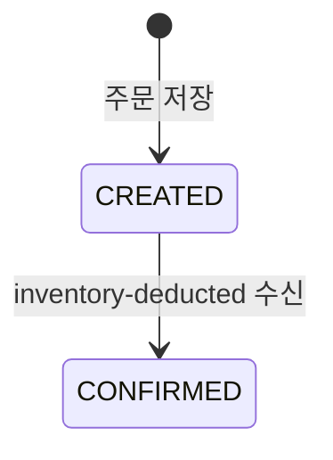

# order-service 기능 구조

이 문서는 Step 2a 기준의 `order-service`가 무엇을 하는 서비스인지 정리한다.  
근거는 [c4-container-structure.md](../c4-container-structure.md)와 [problem-solving-structure.md](../problem-solving-structure.md)다.

---

## 1. 한 줄 정의

`order-service`는 주문을 저장하고 Kafka 순방향 플로우를 시작하고 마무리하는 서비스다.

- 외부 요청을 받는 유일한 진입점이다.
- 주문을 `CREATED` 상태로 저장한 뒤 `order-created` 이벤트를 발행한다.
- `inventory-deducted` 이벤트를 받으면 주문을 `CONFIRMED`로 확정한다.

---

## 2. 왜 이렇게 설계했는가

Step 2a에서 `order-service`의 역할은 Step 1과 크게 다르지 않다.  
바뀐 것은 "결제를 어떻게 부탁하느냐"이지, "누가 주문의 시작과 끝을 책임지느냐"가 아니다.

- 주문은 Client가 직접 만드는 자원이라서 시작점은 여전히 `order-service`여야 한다.
- 주문의 최종 확정도 주문 자신의 상태 변경이므로, 끝점 역시 `order-service`가 맡는 것이 자연스럽다.
- Step 1에서는 하위 서비스 응답을 동기적으로 기다리며 최종 상태를 바로 결정했다.
- Step 2a에서는 서비스 간 결합을 낮추는 것이 목표라서, 주문 생성 시점에는 `CREATED`까지만 책임지고 나머지는 이벤트 흐름에 맡긴다.

즉, `order-service`는 "사용자 진입점 + 주문 aggregate의 상태 책임자"라는 본래 역할을 유지한 채,  
하위 서비스와의 연결 방식만 HTTP에서 Kafka로 바꾼 것이다.

---

## 3. 인터페이스

### 받는 요청

| 종류 | 경로/토픽 | 호출자 | 목적 |
|---|---|---|---|
| HTTP POST | `/api/orders` | Client | 주문 생성 |
| HTTP GET | `/api/orders/{orderId}` | Client | 주문 조회 |
| Kafka Consume | `inventory-deducted` | inventory-service | 주문 확정 |

### 보내는 요청

| 종류 | 경로/토픽 | 대상 | 목적 |
|---|---|---|---|
| Kafka Publish | `order-created` | payment-service | 결제 처리 시작 |

Step 1과 달리 `payment-service`를 HTTP로 직접 호출하지 않는다.

---

## 4. 주문 상태 전이



Step 2a의 핵심은 주문 생성 시 최종 상태를 바로 결정하지 않는다는 점이다.

- 주문 생성 직후에는 항상 `CREATED`
- 재고 차감 완료 이벤트를 받아야 `CONFIRMED`
- Step 2a에는 실패 보상 흐름이 없으므로, 하위 단계에서 실패하면 주문이 `CREATED`에 머무를 수 있다

---

## 5. API / 이벤트 스펙

### 5.1 주문 생성

```
POST /api/orders
```

**Request Body**

| 필드 | 타입 | 필수 | 설명 |
|---|---|---|---|
| sku | String | O | 상품 식별자 |
| quantity | Integer | O | 주문 수량 (1 이상) |
| amount | BigDecimal | O | 결제 금액 (0.01 이상) |

**Response Body**

| 필드 | 타입 | 설명 |
|---|---|---|
| orderId | String | 생성된 주문 ID (UUID) |
| status | String | 초기 주문 상태 (`CREATED`) |
| sku | String | 요청한 상품 식별자 |
| quantity | Integer | 요청한 수량 |
| amount | BigDecimal | 요청한 금액 |

이 응답은 최종 결과가 아니다. 최종 상태는 비동기 처리 후 `GET /api/orders/{orderId}`로 확인한다.

### 5.2 주문 조회

```
GET /api/orders/{orderId}
```

**Path Parameter**

| 파라미터 | 타입 | 설명 |
|---|---|---|
| orderId | String | 조회할 주문 ID |

**Response Body**

주문 생성 응답과 동일한 구조.  
단, 비동기 처리 완료 후에는 `status`가 `CONFIRMED`가 될 수 있다.

### 5.3 발행 이벤트

#### `order-created`

| 필드 | 타입 | 설명 |
|---|---|---|
| orderId | String | 생성된 주문 ID |
| sku | String | 상품 식별자 |
| quantity | Integer | 주문 수량 |
| amount | BigDecimal | 결제 금액 |

### 5.4 수신 이벤트

#### `inventory-deducted`

| 필드 | 타입 | 설명 |
|---|---|---|
| orderId | String | 확정할 주문 ID |
| sku | String | 차감된 상품 식별자 |
| deductedQuantity | Integer | 차감 수량 |
| remainingQuantity | Integer | 남은 재고 |

### 5.5 헬스 체크

```
GET /api/orders/health
```

서비스 생존 확인용. 별도 파라미터 없음.

---

## 6. 이 설계가 드러내는 것

이 서비스 문서에서 가장 중요한 포인트는 `order-service`가 더 이상 "하위 단계 성공 여부를 즉시 아는 서비스"가 아니라는 점이다.

- `POST /api/orders` 응답은 최종 성공이 아니라 "흐름이 시작됐다"는 의미다.
- 최종 확정은 `inventory-deducted` 이벤트를 받을 때까지 미뤄진다.
- 그래서 Step 2a에서는 주문이 `CREATED`에 머무는 상태가 생길 수 있다.

이 불완전함은 문서의 누락이 아니라 의도된 경계다.  
Step 2a는 우선 순방향 이벤트 플로우를 세우고, 실패를 되돌리는 책임은 Step 2b로 넘긴다.
