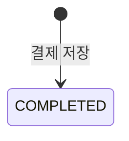

# payment-service 기능 구조

이 문서는 Step 2a 기준의 `payment-service`가 무엇을 하는 서비스인지 정리한다.  
근거는 [c4-container-structure.md](../c4-container-structure.md)와 [problem-solving-structure.md](../problem-solving-structure.md)다.

---

## 1. 한 줄 정의

`payment-service`는 주문 생성 이벤트를 받아 결제를 저장하고 다음 이벤트로 넘기는 중간 단계다.

- `order-created` 이벤트를 받으면 결제를 `COMPLETED`로 저장한다.
- 저장 직후 `payment-completed` 이벤트를 발행한다.
- Step 1과 달리 `inventory-service`를 HTTP로 직접 호출하지 않는다.

---

## 2. 왜 이렇게 설계했는가

`payment-service`는 Step 2a에서 가장 전형적인 "중간 이벤트 처리자" 역할을 맡는다.

- `order-service`가 결제 로직을 직접 알면 다시 강한 결합으로 돌아가므로, 결제 처리는 별도 서비스로 유지한다.
- Step 1에서는 결제 저장 뒤 곧바로 `inventory-service`를 HTTP로 호출했다.
- Step 2a에서는 "결제를 저장했다"는 사실만 이벤트로 남기고 다음 단계에 넘긴다.

이렇게 하면 `payment-service`는 `inventory-service`의 URL이나 가용성을 직접 알 필요가 없다.  
대신 자기 로컬 사실인 "결제가 완료되었다"만 책임지고, 다음 단계 시작은 `payment-completed` 이벤트에 위임한다.

또 하나의 중요한 의도는, Step 2a에서 **비즈니스 순서는 유지하고 통신 방식만 바꾼다**는 점이다.

- Step 1의 순서: 주문 생성 → 결제 → 재고
- Step 2a의 순서도 동일: 주문 생성 → 결제 → 재고

즉, 이 단계의 관심사는 "결제 전에 재고를 잡을 것인가"가 아니라,  
"서비스 간 HTTP 직접 호출을 이벤트 흐름으로 바꿨을 때 시스템이 어떻게 보이는가"다.

---

## 3. 인터페이스

### 받는 요청

| 종류 | 경로/토픽 | 호출자 | 목적 |
|---|---|---|---|
| Kafka Consume | `order-created` | order-service | 결제 처리 시작 |

### 보내는 요청

| 종류 | 경로/토픽 | 대상 | 목적 |
|---|---|---|---|
| Kafka Publish | `payment-completed` | inventory-service | 재고 차감 시작 |

외부 Client와 직접 통신하지 않는다. Step 2a의 runtime path에서는 Kafka 이벤트로만 동작한다.

---

## 4. 결제 상태 전이



현재 상태는 `COMPLETED` 하나뿐이다.

- `order-created`를 받으면 결제를 먼저 저장한다
- 저장이 끝나면 `payment-completed` 이벤트를 발행한다
- 실패 보상이나 취소 상태는 Step 2a 범위가 아니다

---

## 5. API / 이벤트 스펙

### 5.1 수신 이벤트

#### `order-created`

| 필드 | 타입 | 설명 |
|---|---|---|
| orderId | String | 결제 대상 주문 ID |
| sku | String | 상품 식별자 |
| quantity | Integer | 주문 수량 |
| amount | BigDecimal | 결제 금액 |

### 5.2 발행 이벤트

#### `payment-completed`

| 필드 | 타입 | 설명 |
|---|---|---|
| orderId | String | 결제가 완료된 주문 ID |
| paymentId | String | 생성된 결제 ID (UUID) |
| amount | BigDecimal | 결제 금액 |
| sku | String | 상품 식별자 |
| quantity | Integer | 다음 단계가 차감할 수량 |

### 5.3 헬스 체크

```
GET /api/payments/health
```

서비스 생존 확인용. 별도 파라미터 없음.

---

## 6. 이 서비스가 의미하는 것

`payment-service`는 더 이상 "재고 차감 성공 여부를 동기 응답으로 기다리는 서비스"가 아니다.

- Step 1에서는 결제 후 재고 결과를 즉시 받아야 했다
- Step 2a에서는 결제 완료 사실만 이벤트로 넘기고 다음 단계로 진행한다
- 따라서 재고 실패는 이 서비스가 즉시 알 수 있는 문제가 아니라, 다음 단계에서 별도로 다뤄야 할 문제가 된다

이 설계는 일부러 불완전하다.

- 결제 성공 이후 재고 실패를 되돌리는 흐름은 아직 없다
- 그래서 `payment-service`는 성공 사실을 발행만 하고, 나중에 취소될 가능성까지는 다루지 않는다

이 빈자리가 바로 Step 2b에서 `payment-cancelled` 같은 보상 이벤트가 들어올 자리다.
