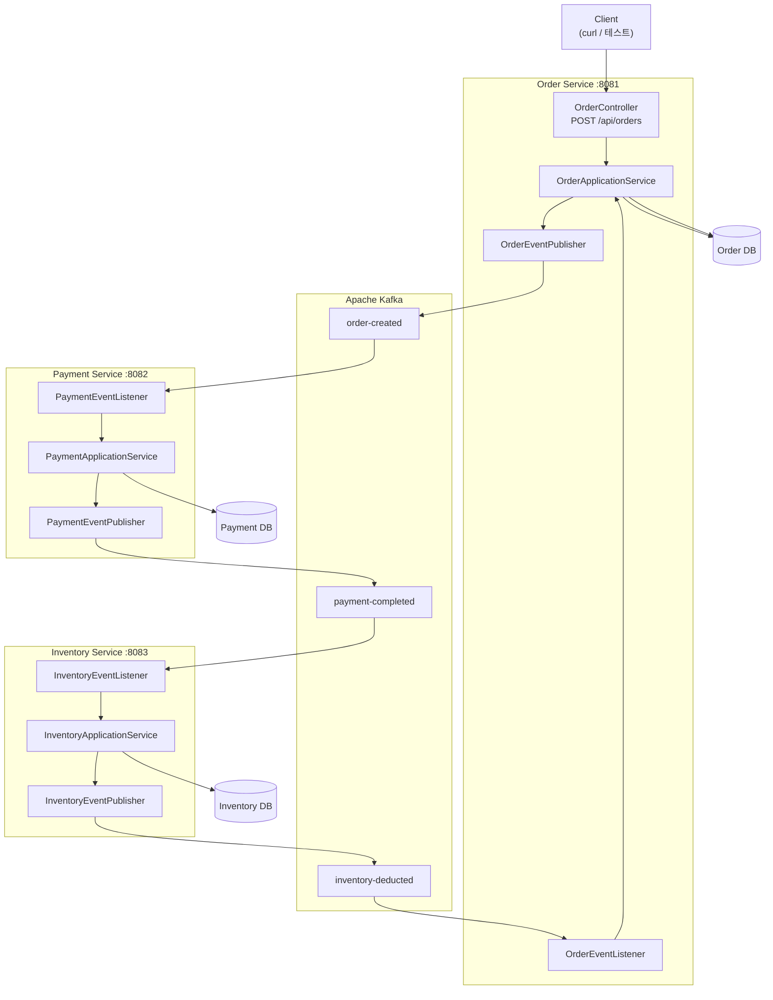
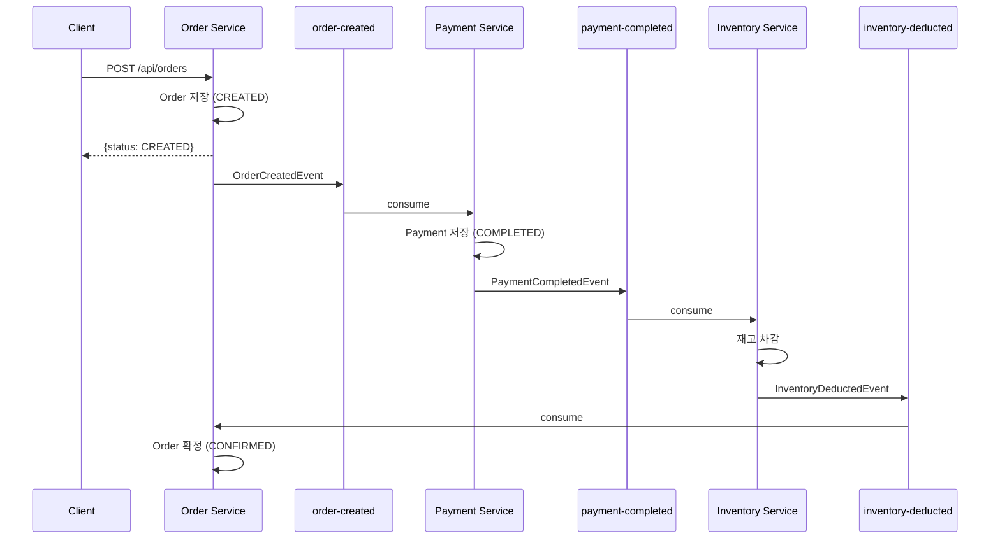

# Step 2a: Kafka 순방향 플로우 구현 계획

> **For agentic workers:** REQUIRED SUB-SKILL: Use superpowers:subagent-driven-development (recommended) or superpowers:executing-plans to implement this plan task-by-task. Steps use checkbox (`- [ ]`) syntax for tracking.

**Goal:** REST 호출 체이닝을 Kafka 이벤트로 전환하여, "주문 생성 → 결제 처리 → 재고 차감 → 주문 확정"이 이벤트 기반으로 동작하게 한다.

**Architecture:** 각 서비스가 KafkaTemplate으로 이벤트를 발행하고 @KafkaListener로 수신하는 Choreography 방식. 이벤트 레코드는 saga-events 공유 모듈에 정의한다. REST 호출 체이닝(PaymentClient, InventoryClient)은 제거하고, 서비스 간 통신은 전부 Kafka 토픽을 통한다. 주문 API는 CREATED 상태를 즉시 반환하고, 최종 확정(CONFIRMED)은 비동기로 처리된다.

**Tech Stack:** Spring Kafka, Apache Kafka (KRaft mode), Docker Compose, Testcontainers (테스트), Awaitility (비동기 테스트)

## Scope Guardrails

### In Scope

- Kafka happy path 순방향 플로우만 구현한다: `order-created → payment-completed → inventory-deducted`
- 주문 API 계약을 비동기 방식으로 바꾼다: `POST /api/orders` 는 즉시 `CREATED` 를 반환한다
- 위 계약 변경 때문에 깨지는 기존 unit/integration/scenario 테스트도 함께 정리한다

### Out of Scope

- 보상 트랜잭션, 실패 이벤트, 주문 취소/환불/재고 복구
- retry/backoff, DLT, idempotency, deduplication, exactly-once
- outbox 패턴, CDC, schema registry, 운영용 Kafka 보안/모니터링 하드닝
- Step 2b 이후에 다룰 실패 전파 정책

### Implementation Decisions

- Step 2a의 acceptance criteria 는 Kafka 기반 happy path 완료다. 실패 시나리오 자동화는 Step 2b로 미룬다.
- `GET` 조회/health endpoint는 유지한다.
- `/internal/payments`, `/internal/inventory/deduct` 같은 내부 쓰기 endpoint는 남겨도 되지만, 더 이상 saga runtime path에서는 사용하지 않는다. 남겨둘 경우 현재 command 시그니처에 맞게 DTO/controller/test를 같이 수정해야 한다.
- 로컬 Docker Compose 와 Testcontainers 환경은 Kafka topic auto-creation 이 켜져 있다고 가정한다. `NewTopic`/`KafkaAdmin` 같은 운영 하드닝은 Step 2a 범위에 포함하지 않는다.

---

## File Structure

### 새로 생성

| 파일 | 역할 |
|------|------|
| `docker-compose.yml` | Kafka 로컬 실행 (KRaft mode, Zookeeper 없음) |
| `saga-events/build.gradle` | 이벤트 공유 모듈 |
| `saga-events/src/main/java/com/ordersaga/events/OrderCreatedEvent.java` | 주문 생성 이벤트 |
| `saga-events/src/main/java/com/ordersaga/events/PaymentCompletedEvent.java` | 결제 완료 이벤트 |
| `saga-events/src/main/java/com/ordersaga/events/InventoryDeductedEvent.java` | 재고 차감 완료 이벤트 |
| `order-service/.../infrastructure/OrderEventPublisher.java` | 주문 이벤트 발행 |
| `order-service/.../infrastructure/OrderEventListener.java` | 재고 차감 완료 수신 → 주문 확정 |
| `payment-service/.../infrastructure/PaymentEventPublisher.java` | 결제 이벤트 발행 |
| `payment-service/.../infrastructure/PaymentEventListener.java` | 주문 생성 수신 → 결제 처리 |
| `inventory-service/.../infrastructure/InventoryEventPublisher.java` | 재고 이벤트 발행 |
| `inventory-service/.../infrastructure/InventoryEventListener.java` | 결제 완료 수신 → 재고 차감 |
| `docs/architecture/step2a-event-flow.md` | 아키텍처 다이어그램 (구조도 + 흐름도) |

### 수정

| 파일 | 변경 |
|------|------|
| `settings.gradle` | `saga-events` 모듈 추가 |
| `build.gradle` | `spring-kafka` 의존성 추가 |
| `order-service/build.gradle` | `saga-events` 의존성 추가 |
| `payment-service/build.gradle` | `saga-events` 의존성 추가 |
| `inventory-service/build.gradle` | `saga-events` 의존성 추가 |
| `order-service/.../application/OrderApplicationService.java` | PaymentClient → EventPublisher, confirmOrder 메서드 추가 |
| `order-service/.../application/CreateOrderCommand.java` | `forceInventoryFailure` 필드 제거 |
| `order-service/.../presentation/OrderController.java` | command 생성에서 forceInventoryFailure 제거 |
| `payment-service/.../application/PaymentApplicationService.java` | InventoryClient → EventPublisher |
| `payment-service/.../application/ChargePaymentCommand.java` | `forceInventoryFailure` 필드 제거 |
| `inventory-service/.../application/InventoryApplicationService.java` | EventPublisher 추가, orderId 받기 |
| `inventory-service/.../application/DeductInventoryCommand.java` | `forceFailure` → `orderId` 필드 교체 |
| `order-service/.../presentation/dto/CreateOrderRequest.java` | `forceInventoryFailure` 제거, 주문 API를 비동기 계약으로 정리 |
| `order-service/src/test/java/com/ordersaga/order/fixture/CreateOrderRequestFixture.java` | 3필드 request로 정리 |
| `order-service/src/test/java/com/ordersaga/order/presentation/CreateOrderIntegrationTest.java` | `CREATED` 응답 기준으로 수정, publisher mock 사용 |
| `payment-service/.../presentation/PaymentController.java` | 내부 endpoint를 유지한다면 새 command 시그니처에 맞게 수정 |
| `payment-service/.../presentation/dto/ChargePaymentRequest.java` | `forceInventoryFailure` 제거 |
| `payment-service/src/test/java/com/ordersaga/payment/fixture/ChargePaymentRequestFixture.java` | request fixture 정리 |
| `payment-service/src/test/java/com/ordersaga/payment/presentation/ChargePaymentIntegrationTest.java` | `InventoryClient` 의존 제거 후 publisher mock 기준으로 수정 |
| `inventory-service/.../presentation/InventoryController.java` | 내부 endpoint를 유지한다면 `orderId` 포함 요청으로 수정 |
| `inventory-service/.../presentation/dto/DeductInventoryRequest.java` | `orderId` 추가, `forceFailure` 제거 |
| `inventory-service/src/test/java/com/ordersaga/inventory/fixture/DeductInventoryRequestFixture.java` | request fixture 정리 |
| `inventory-service/src/test/java/com/ordersaga/inventory/presentation/DeductInventoryIntegrationTest.java` | publisher mock 기준으로 수정 |
| `order-service/src/main/resources/application.yml` | Kafka 설정 추가 |
| `payment-service/src/main/resources/application.yml` | Kafka 설정 추가 |
| `inventory-service/src/main/resources/application.yml` | Kafka 설정 추가 |
| `scenario-test/build.gradle` | Testcontainers, Awaitility 의존성 |
| `scenario-test/.../OrderProcessingScenarioTest.java` | Kafka 기반 비동기 테스트로 전환 |

### 삭제

| 파일 | 이유 |
|------|------|
| `order-service/.../infrastructure/PaymentClient.java` | REST 체이닝 제거 (Kafka로 대체) |
| `payment-service/.../infrastructure/InventoryClient.java` | REST 체이닝 제거 (Kafka로 대체) |

---

## 이벤트 플로우 (Step 2a 범위)

```
[User] → POST /api/orders → [Order Service]
                                  │ save(CREATED)
                                  │ publish → order-created 토픽
                                  ▼
                            [Payment Service]
                                  │ @KafkaListener
                                  │ save(COMPLETED)
                                  │ publish → payment-completed 토픽
                                  ▼
                            [Inventory Service]
                                  │ @KafkaListener
                                  │ deduct inventory
                                  │ publish → inventory-deducted 토픽
                                  ▼
                            [Order Service]
                                  │ @KafkaListener
                                  │ confirm(CONFIRMED)
```

---

### Task 1: Infrastructure — Docker Compose + Gradle 의존성 + 이벤트 모듈

**Files:**
- Create: `docker-compose.yml`
- Create: `saga-events/build.gradle`
- Create: `saga-events/src/main/java/com/ordersaga/events/OrderCreatedEvent.java`
- Create: `saga-events/src/main/java/com/ordersaga/events/PaymentCompletedEvent.java`
- Create: `saga-events/src/main/java/com/ordersaga/events/InventoryDeductedEvent.java`
- Modify: `settings.gradle`
- Modify: `build.gradle`
- Modify: `order-service/build.gradle`
- Modify: `payment-service/build.gradle`
- Modify: `inventory-service/build.gradle`

- [ ] **Step 1: Docker Compose 작성**

```yaml
# docker-compose.yml
services:
  kafka:
    image: apache/kafka:3.9.0
    ports:
      - "9092:9092"
    environment:
      KAFKA_NODE_ID: 1
      KAFKA_PROCESS_ROLES: broker,controller
      KAFKA_LISTENERS: PLAINTEXT://0.0.0.0:9092,CONTROLLER://0.0.0.0:9093
      KAFKA_ADVERTISED_LISTENERS: PLAINTEXT://localhost:9092
      KAFKA_CONTROLLER_LISTENER_NAMES: CONTROLLER
      KAFKA_LISTENER_SECURITY_PROTOCOL_MAP: CONTROLLER:PLAINTEXT,PLAINTEXT:PLAINTEXT
      KAFKA_CONTROLLER_QUORUM_VOTERS: 1@localhost:9093
      KAFKA_OFFSETS_TOPIC_REPLICATION_FACTOR: 1
      KAFKA_TRANSACTION_STATE_LOG_REPLICATION_FACTOR: 1
      KAFKA_TRANSACTION_STATE_LOG_MIN_ISR: 1
```

- [ ] **Step 2: Docker Compose 실행 확인**

Run: `docker compose up -d && sleep 5 && docker compose exec kafka /opt/kafka/bin/kafka-topics.sh --bootstrap-server localhost:9092 --list`
Expected: Kafka가 정상 기동되고 토픽 목록 조회가 성공한다 (빈 목록 또는 내부 토픽만 표시).

- [ ] **Step 3: saga-events 모듈 생성**

`settings.gradle`에 모듈 추가:
```gradle
rootProject.name = 'order-saga-mvp'

include 'saga-events'
include 'order-service'
include 'payment-service'
include 'inventory-service'
include 'scenario-test'
```

`saga-events/build.gradle`:
```gradle
tasks.named('bootJar') {
    enabled = false
}

tasks.named('jar') {
    enabled = true
}
```

공유 이벤트 모듈은 Spring Boot 애플리케이션이 아니라 plain jar 용도다. 루트 `subprojects` 공통 설정 때문에 Boot plugin 이 적용되더라도, 이 모듈의 acceptance criteria 는 "이벤트 record 를 담는 공유 jar" 까지다.

- [ ] **Step 4: 이벤트 레코드 작성**

`saga-events/src/main/java/com/ordersaga/events/OrderCreatedEvent.java`:
```java
package com.ordersaga.events;

import java.math.BigDecimal;

public record OrderCreatedEvent(
        String orderId,
        String sku,
        Integer quantity,
        BigDecimal amount
) {
}
```

`saga-events/src/main/java/com/ordersaga/events/PaymentCompletedEvent.java`:
```java
package com.ordersaga.events;

import java.math.BigDecimal;

public record PaymentCompletedEvent(
        String orderId,
        String paymentId,
        BigDecimal amount,
        String sku,
        Integer quantity
) {
}
```

`saga-events/src/main/java/com/ordersaga/events/InventoryDeductedEvent.java`:
```java
package com.ordersaga.events;

public record InventoryDeductedEvent(
        String orderId,
        String sku,
        Integer deductedQuantity,
        Integer remainingQuantity
) {
}
```

- [ ] **Step 5: Gradle 의존성 추가**

`build.gradle` (루트) subprojects 블록의 dependencies에 spring-kafka 추가:
```gradle
dependencies {
    implementation 'org.springframework.boot:spring-boot-starter-webmvc'
    implementation 'org.springframework.boot:spring-boot-starter-validation'
    implementation 'org.springframework.boot:spring-boot-starter-data-jpa'
    implementation 'org.springframework.kafka:spring-kafka'

    developmentOnly 'org.springframework.boot:spring-boot-devtools'

    runtimeOnly 'com.h2database:h2'
    runtimeOnly 'org.postgresql:postgresql'

    testImplementation 'org.springframework.boot:spring-boot-starter-test'
    testImplementation 'org.springframework.boot:spring-boot-starter-webmvc-test'
    testImplementation 'org.springframework.boot:spring-boot-starter-jackson-test'
    testImplementation 'org.springframework.kafka:spring-kafka-test'
}
```

각 서비스 build.gradle에 saga-events 의존성 추가:

`order-service/build.gradle`:
```gradle
dependencies {
    implementation project(':saga-events')
}

springBoot {
    mainClass = 'com.ordersaga.order.OrderServiceApplication'
}
```

`payment-service/build.gradle`:
```gradle
dependencies {
    implementation project(':saga-events')
}

springBoot {
    mainClass = 'com.ordersaga.payment.PaymentServiceApplication'
}
```

`inventory-service/build.gradle`:
```gradle
dependencies {
    implementation project(':saga-events')
}

springBoot {
    mainClass = 'com.ordersaga.inventory.InventoryServiceApplication'
}
```

- [ ] **Step 6: 빌드 확인**

Run: `./gradlew clean build -x test`
Expected: BUILD SUCCESSFUL. 모든 모듈이 컴파일된다.

- [ ] **Step 7: 커밋**

```bash
git add docker-compose.yml saga-events/ settings.gradle build.gradle \
  order-service/build.gradle payment-service/build.gradle inventory-service/build.gradle
git commit -m "Add: Docker Compose Kafka + saga-events 모듈 + spring-kafka 의존성"
```

---

### Task 2: Kafka 설정 — 각 서비스 application.yml

**Files:**
- Modify: `order-service/src/main/resources/application.yml`
- Modify: `payment-service/src/main/resources/application.yml`
- Modify: `inventory-service/src/main/resources/application.yml`

- [ ] **Step 1: order-service application.yml 수정**

```yaml
spring:
  application:
    name: order-service
  jpa:
    properties:
      hibernate:
        format_sql: true
  kafka:
    bootstrap-servers: localhost:9092
    consumer:
      group-id: order-service
      auto-offset-reset: earliest
      key-deserializer: org.apache.kafka.common.serialization.StringDeserializer
      value-deserializer: org.springframework.kafka.support.serializer.JsonDeserializer
      properties:
        spring.json.trusted.packages: "com.ordersaga.events"
    producer:
      key-serializer: org.apache.kafka.common.serialization.StringSerializer
      value-serializer: org.springframework.kafka.support.serializer.JsonSerializer

server:
  port: 8081

logging:
  level:
    org.hibernate.SQL: DEBUG
    org.hibernate.orm.jdbc.bind: TRACE
```

- [ ] **Step 2: payment-service application.yml 수정**

```yaml
spring:
  application:
    name: payment-service
  jpa:
    properties:
      hibernate:
        format_sql: true
  kafka:
    bootstrap-servers: localhost:9092
    consumer:
      group-id: payment-service
      auto-offset-reset: earliest
      key-deserializer: org.apache.kafka.common.serialization.StringDeserializer
      value-deserializer: org.springframework.kafka.support.serializer.JsonDeserializer
      properties:
        spring.json.trusted.packages: "com.ordersaga.events"
    producer:
      key-serializer: org.apache.kafka.common.serialization.StringSerializer
      value-serializer: org.springframework.kafka.support.serializer.JsonSerializer

server:
  port: 8082

logging:
  level:
    org.hibernate.SQL: DEBUG
    org.hibernate.orm.jdbc.bind: TRACE
```

- [ ] **Step 3: inventory-service application.yml 수정**

```yaml
spring:
  application:
    name: inventory-service
  jpa:
    defer-datasource-initialization: true
    properties:
      hibernate:
        format_sql: true
  kafka:
    bootstrap-servers: localhost:9092
    consumer:
      group-id: inventory-service
      auto-offset-reset: earliest
      key-deserializer: org.apache.kafka.common.serialization.StringDeserializer
      value-deserializer: org.springframework.kafka.support.serializer.JsonDeserializer
      properties:
        spring.json.trusted.packages: "com.ordersaga.events"
    producer:
      key-serializer: org.apache.kafka.common.serialization.StringSerializer
      value-serializer: org.springframework.kafka.support.serializer.JsonSerializer

server:
  port: 8083

logging:
  level:
    org.hibernate.SQL: DEBUG
    org.hibernate.orm.jdbc.bind: TRACE
```

- [ ] **Step 4: 빌드 확인**

Run: `./gradlew clean build -x test`
Expected: BUILD SUCCESSFUL.

- [ ] **Step 5: 커밋**

```bash
git add order-service/src/main/resources/application.yml \
  payment-service/src/main/resources/application.yml \
  inventory-service/src/main/resources/application.yml
git commit -m "Add: 각 서비스 Kafka 설정 (bootstrap-servers, JSON 직렬화)"
```

---

### Task 3: Order Service — 이벤트 발행 + REST 클라이언트 제거

**Files:**
- Create: `order-service/src/main/java/com/ordersaga/order/infrastructure/OrderEventPublisher.java`
- Modify: `order-service/src/main/java/com/ordersaga/order/application/OrderApplicationService.java`
- Modify: `order-service/src/main/java/com/ordersaga/order/application/CreateOrderCommand.java`
- Modify: `order-service/src/main/java/com/ordersaga/order/presentation/OrderController.java`
- Modify: `order-service/src/main/java/com/ordersaga/order/presentation/dto/CreateOrderRequest.java`
- Delete: `order-service/src/main/java/com/ordersaga/order/infrastructure/PaymentClient.java`
- Modify: `order-service/src/test/java/com/ordersaga/order/application/CreateOrderApplicationTest.java`
- Modify: `order-service/src/test/java/com/ordersaga/order/fixture/CreateOrderCommandFixture.java`
- Modify: `order-service/src/test/java/com/ordersaga/order/fixture/CreateOrderRequestFixture.java`
- Modify: `order-service/src/test/java/com/ordersaga/order/presentation/CreateOrderIntegrationTest.java`

- [ ] **Step 1: OrderEventPublisher 작성**

`order-service/src/main/java/com/ordersaga/order/infrastructure/OrderEventPublisher.java`:
```java
package com.ordersaga.order.infrastructure;

import com.ordersaga.events.OrderCreatedEvent;
import org.springframework.kafka.core.KafkaTemplate;
import org.springframework.stereotype.Component;

@Component
public class OrderEventPublisher {
    private final KafkaTemplate<String, Object> kafkaTemplate;

    public OrderEventPublisher(KafkaTemplate<String, Object> kafkaTemplate) {
        this.kafkaTemplate = kafkaTemplate;
    }

    public void publishOrderCreated(OrderCreatedEvent event) {
        kafkaTemplate.send("order-created", event.orderId(), event);
    }
}
```

- [ ] **Step 2: CreateOrderCommand에서 forceInventoryFailure 제거**

```java
package com.ordersaga.order.application;

import java.math.BigDecimal;

public record CreateOrderCommand(
        String sku,
        Integer quantity,
        BigDecimal amount
) {
}
```

- [ ] **Step 2a: CreateOrderRequest에서도 forceInventoryFailure 제거**

`order-service/src/main/java/com/ordersaga/order/presentation/dto/CreateOrderRequest.java`:
```java
package com.ordersaga.order.presentation.dto;

import java.math.BigDecimal;

import jakarta.validation.constraints.DecimalMin;
import jakarta.validation.constraints.NotBlank;
import jakarta.validation.constraints.NotNull;
import jakarta.validation.constraints.Positive;

public record CreateOrderRequest(
        @NotBlank(message = "sku is required")
        String sku,

        @NotNull(message = "quantity is required")
        @Positive(message = "quantity must be greater than zero")
        Integer quantity,

        @NotNull(message = "amount is required")
        @DecimalMin(value = "0.01", message = "amount must be at least 0.01")
        BigDecimal amount
) {
}
```

- [ ] **Step 3: OrderApplicationService를 이벤트 기반으로 변경**

```java
package com.ordersaga.order.application;

import com.ordersaga.events.OrderCreatedEvent;
import com.ordersaga.order.domain.Order;
import com.ordersaga.order.domain.OrderRepository;
import com.ordersaga.order.infrastructure.OrderEventPublisher;
import org.springframework.stereotype.Service;
import org.springframework.transaction.annotation.Transactional;

@Service
public class OrderApplicationService {
    private final OrderRepository orderRepository;
    private final OrderEventPublisher eventPublisher;

    public OrderApplicationService(OrderRepository orderRepository, OrderEventPublisher eventPublisher) {
        this.orderRepository = orderRepository;
        this.eventPublisher = eventPublisher;
    }

    public OrderResult createOrder(CreateOrderCommand command) {
        Order order = Order.create(command.sku(), command.quantity(), command.amount());
        orderRepository.save(order);

        eventPublisher.publishOrderCreated(new OrderCreatedEvent(
                order.getOrderId(), command.sku(), command.quantity(), command.amount()
        ));

        return OrderResult.from(order);
    }

    @Transactional
    public void confirmOrder(String orderId) {
        Order order = orderRepository.findByOrderId(orderId)
                .orElseThrow(() -> new IllegalArgumentException("order not found: " + orderId));
        order.confirm();
    }

    public OrderResult getOrder(String orderId) {
        Order order = orderRepository.findByOrderId(orderId)
                .orElseThrow(() -> new IllegalArgumentException("order not found: " + orderId));
        return OrderResult.from(order);
    }
}
```

- [ ] **Step 4: OrderController에서 forceInventoryFailure 제거**

```java
@PostMapping
public OrderResult createOrder(@Valid @RequestBody CreateOrderRequest request) {
    CreateOrderCommand command = new CreateOrderCommand(
            request.sku(),
            request.quantity(),
            request.amount()
    );
    return orderApplicationService.createOrder(command);
}
```

- [ ] **Step 5: PaymentClient 삭제**

```bash
rm order-service/src/main/java/com/ordersaga/order/infrastructure/PaymentClient.java
```

- [ ] **Step 6: 단위 테스트 업데이트 — CreateOrderCommandFixture**

`order-service/src/test/java/com/ordersaga/order/fixture/CreateOrderCommandFixture.java`:
```java
package com.ordersaga.order.fixture;

import com.ordersaga.order.application.CreateOrderCommand;

import java.math.BigDecimal;

public class CreateOrderCommandFixture {

    public static CreateOrderCommand normal() {
        return new CreateOrderCommand(
                OrderFixtureValues.SKU,
                OrderFixtureValues.QUANTITY,
                BigDecimal.valueOf(OrderFixtureValues.AMOUNT)
        );
    }
}
```

- [ ] **Step 6a: request fixture / integration test도 비동기 계약으로 정리**

- `CreateOrderRequestFixture` 는 3개 필드만 생성한다.
- `CreateOrderIntegrationTest` 는 `PaymentClient` 대신 `OrderEventPublisher` 를 mock 한다.
- 성공 케이스는 `CREATED` 응답을 기대한다.
- 기존 `FAILED` 동기 응답 테스트는 제거한다. Step 2a에서는 downstream 실패를 주문 API 동기 응답으로 노출하지 않는다.

- [ ] **Step 7: 단위 테스트 업데이트 — CreateOrderApplicationTest**

```java
package com.ordersaga.order.application;

import com.ordersaga.order.domain.Order;
import com.ordersaga.order.domain.OrderRepository;
import com.ordersaga.order.domain.OrderStatus;
import com.ordersaga.order.fixture.CreateOrderCommandFixture;
import com.ordersaga.order.infrastructure.OrderEventPublisher;
import org.junit.jupiter.api.BeforeEach;
import org.junit.jupiter.api.DisplayName;
import org.junit.jupiter.api.Test;
import org.junit.jupiter.api.extension.ExtendWith;
import org.mockito.ArgumentCaptor;
import org.mockito.Mock;
import org.mockito.junit.jupiter.MockitoExtension;

import static org.assertj.core.api.Assertions.assertThat;
import static org.mockito.ArgumentMatchers.any;
import static org.mockito.BDDMockito.willAnswer;

@ExtendWith(MockitoExtension.class)
class CreateOrderApplicationTest {

    @Mock
    private OrderRepository orderRepository;

    @Mock
    private OrderEventPublisher eventPublisher;

    private OrderApplicationService sut;

    @BeforeEach
    void setUp() {
        sut = new OrderApplicationService(orderRepository, eventPublisher);
    }

    @Test
    @DisplayName("주문 생성 시 CREATED 상태로 저장하고 이벤트를 발행한다")
    void createOrder_savesCreatedAndPublishesEvent() {
        // Arrange
        willAnswer(invocation -> invocation.getArgument(0))
                .given(orderRepository).save(any(Order.class));
        CreateOrderCommand command = CreateOrderCommandFixture.normal();

        // Act
        OrderResult result = sut.createOrder(command);

        // Assert
        assertThat(result.status()).isEqualTo(OrderStatus.CREATED);
    }
}
```

- [ ] **Step 8: 빌드 확인**

Run: `./gradlew :order-service:test`
Expected: 테스트 통과. `CreateOrderIntegrationTest` 도 함께 수정했기 때문에 모듈 전체 테스트를 돌려도 된다.

- [ ] **Step 9: 커밋**

```bash
git add order-service/ -A
git commit -m "Update: order-service REST→Kafka 전환 (이벤트 발행, PaymentClient 제거)"
```

---

### Task 4: Payment Service — 이벤트 수신 + 발행 + REST 클라이언트 제거

**Files:**
- Create: `payment-service/src/main/java/com/ordersaga/payment/infrastructure/PaymentEventPublisher.java`
- Create: `payment-service/src/main/java/com/ordersaga/payment/infrastructure/PaymentEventListener.java`
- Modify: `payment-service/src/main/java/com/ordersaga/payment/application/PaymentApplicationService.java`
- Modify: `payment-service/src/main/java/com/ordersaga/payment/application/ChargePaymentCommand.java`
- Modify: `payment-service/src/main/java/com/ordersaga/payment/presentation/PaymentController.java`
- Modify: `payment-service/src/main/java/com/ordersaga/payment/presentation/dto/ChargePaymentRequest.java`
- Delete: `payment-service/src/main/java/com/ordersaga/payment/infrastructure/InventoryClient.java`
- Modify: `payment-service/src/test/java/com/ordersaga/payment/application/ChargePaymentApplicationTest.java`
- Modify: `payment-service/src/test/java/com/ordersaga/payment/fixture/ChargePaymentCommandFixture.java`
- Modify: `payment-service/src/test/java/com/ordersaga/payment/fixture/ChargePaymentRequestFixture.java`
- Modify: `payment-service/src/test/java/com/ordersaga/payment/presentation/ChargePaymentIntegrationTest.java`

- [ ] **Step 1: PaymentEventPublisher 작성**

`payment-service/src/main/java/com/ordersaga/payment/infrastructure/PaymentEventPublisher.java`:
```java
package com.ordersaga.payment.infrastructure;

import com.ordersaga.events.PaymentCompletedEvent;
import org.springframework.kafka.core.KafkaTemplate;
import org.springframework.stereotype.Component;

@Component
public class PaymentEventPublisher {
    private final KafkaTemplate<String, Object> kafkaTemplate;

    public PaymentEventPublisher(KafkaTemplate<String, Object> kafkaTemplate) {
        this.kafkaTemplate = kafkaTemplate;
    }

    public void publishPaymentCompleted(PaymentCompletedEvent event) {
        kafkaTemplate.send("payment-completed", event.orderId(), event);
    }
}
```

- [ ] **Step 2: ChargePaymentCommand에서 forceInventoryFailure 제거**

```java
package com.ordersaga.payment.application;

import java.math.BigDecimal;

public record ChargePaymentCommand(
        String orderId,
        BigDecimal amount,
        String sku,
        Integer quantity
) {
}
```

- [ ] **Step 3: PaymentApplicationService를 이벤트 기반으로 변경**

```java
package com.ordersaga.payment.application;

import com.ordersaga.events.PaymentCompletedEvent;
import com.ordersaga.payment.domain.Payment;
import com.ordersaga.payment.domain.PaymentRepository;
import com.ordersaga.payment.infrastructure.PaymentEventPublisher;
import org.springframework.stereotype.Service;

@Service
public class PaymentApplicationService {
    private final PaymentRepository paymentRepository;
    private final PaymentEventPublisher eventPublisher;

    public PaymentApplicationService(PaymentRepository paymentRepository,
                                     PaymentEventPublisher eventPublisher) {
        this.paymentRepository = paymentRepository;
        this.eventPublisher = eventPublisher;
    }

    public PaymentResult chargePayment(ChargePaymentCommand command) {
        Payment payment = Payment.complete(command.orderId(), command.amount());
        paymentRepository.save(payment);

        eventPublisher.publishPaymentCompleted(new PaymentCompletedEvent(
                payment.getOrderId(),
                payment.getPaymentId(),
                payment.getAmount(),
                command.sku(),
                command.quantity()
        ));

        return PaymentResult.from(payment);
    }
}
```

- [ ] **Step 4: PaymentEventListener 작성**

`payment-service/src/main/java/com/ordersaga/payment/infrastructure/PaymentEventListener.java`:
```java
package com.ordersaga.payment.infrastructure;

import com.ordersaga.events.OrderCreatedEvent;
import com.ordersaga.payment.application.ChargePaymentCommand;
import com.ordersaga.payment.application.PaymentApplicationService;
import org.slf4j.Logger;
import org.slf4j.LoggerFactory;
import org.springframework.kafka.annotation.KafkaListener;
import org.springframework.stereotype.Component;

@Component
public class PaymentEventListener {
    private static final Logger log = LoggerFactory.getLogger(PaymentEventListener.class);
    private final PaymentApplicationService paymentApplicationService;

    public PaymentEventListener(PaymentApplicationService paymentApplicationService) {
        this.paymentApplicationService = paymentApplicationService;
    }

    @KafkaListener(topics = "order-created", groupId = "payment-service")
    public void handleOrderCreated(OrderCreatedEvent event) {
        log.info("Received order-created: orderId={}", event.orderId());
        paymentApplicationService.chargePayment(new ChargePaymentCommand(
                event.orderId(),
                event.amount(),
                event.sku(),
                event.quantity()
        ));
    }
}
```

- [ ] **Step 4a: 내부 REST endpoint를 유지한다면 request/controller/test도 같이 정리**

- `ChargePaymentRequest` 에서 `forceInventoryFailure` 를 제거한다.
- `PaymentController` 는 4개 필드짜리 `ChargePaymentCommand` 를 생성한다.
- `ChargePaymentIntegrationTest` 는 `InventoryClient` 가 아니라 `PaymentEventPublisher` 기준으로 mock/검증한다.
- 이 endpoint는 더 이상 saga runtime path 에서 호출되지 않고, 로컬 수동 검증용 compatibility endpoint 로만 남는다.

- [ ] **Step 5: InventoryClient 삭제**

```bash
rm payment-service/src/main/java/com/ordersaga/payment/infrastructure/InventoryClient.java
```

- [ ] **Step 6: 단위 테스트 업데이트 — ChargePaymentCommandFixture**

`payment-service/src/test/java/com/ordersaga/payment/fixture/ChargePaymentCommandFixture.java`:
```java
package com.ordersaga.payment.fixture;

import com.ordersaga.payment.application.ChargePaymentCommand;

import java.math.BigDecimal;

public class ChargePaymentCommandFixture {

    public static ChargePaymentCommand normal() {
        return new ChargePaymentCommand(
                PaymentFixtureValues.ORDER_ID,
                BigDecimal.valueOf(PaymentFixtureValues.AMOUNT),
                PaymentFixtureValues.SKU,
                PaymentFixtureValues.QUANTITY
        );
    }
}
```

- [ ] **Step 7: 단위 테스트 업데이트 — ChargePaymentApplicationTest**

```java
package com.ordersaga.payment.application;

import com.ordersaga.payment.domain.Payment;
import com.ordersaga.payment.domain.PaymentRepository;
import com.ordersaga.payment.domain.PaymentStatus;
import com.ordersaga.payment.fixture.ChargePaymentCommandFixture;
import com.ordersaga.payment.infrastructure.PaymentEventPublisher;
import org.junit.jupiter.api.BeforeEach;
import org.junit.jupiter.api.DisplayName;
import org.junit.jupiter.api.Test;
import org.junit.jupiter.api.extension.ExtendWith;
import org.mockito.Mock;
import org.mockito.junit.jupiter.MockitoExtension;

import static org.assertj.core.api.Assertions.assertThat;
import static org.mockito.ArgumentMatchers.any;
import static org.mockito.BDDMockito.willAnswer;

@ExtendWith(MockitoExtension.class)
class ChargePaymentApplicationTest {

    @Mock
    private PaymentRepository paymentRepository;

    @Mock
    private PaymentEventPublisher eventPublisher;

    private PaymentApplicationService sut;

    @BeforeEach
    void setUp() {
        sut = new PaymentApplicationService(paymentRepository, eventPublisher);
    }

    @Test
    @DisplayName("결제 처리 시 COMPLETED 상태로 저장하고 이벤트를 발행한다")
    void chargePayment_savesCompletedAndPublishesEvent() {
        // Arrange
        willAnswer(invocation -> invocation.getArgument(0))
                .given(paymentRepository).save(any(Payment.class));
        ChargePaymentCommand command = ChargePaymentCommandFixture.normal();

        // Act
        PaymentResult result = sut.chargePayment(command);

        // Assert
        assertThat(result.status()).isEqualTo(PaymentStatus.COMPLETED);
    }
}
```

- [ ] **Step 8: 빌드 확인**

Run: `./gradlew :payment-service:test`
Expected: 모듈 전체 테스트 통과. (`ChargePaymentIntegrationTest` 포함)

- [ ] **Step 9: 커밋**

```bash
git add payment-service/ -A
git commit -m "Update: payment-service REST→Kafka 전환 (이벤트 수신/발행, InventoryClient 제거)"
```

---

### Task 5: Inventory Service — 이벤트 수신 + 발행

**Files:**
- Create: `inventory-service/src/main/java/com/ordersaga/inventory/infrastructure/InventoryEventPublisher.java`
- Create: `inventory-service/src/main/java/com/ordersaga/inventory/infrastructure/InventoryEventListener.java`
- Modify: `inventory-service/src/main/java/com/ordersaga/inventory/application/InventoryApplicationService.java`
- Modify: `inventory-service/src/main/java/com/ordersaga/inventory/application/DeductInventoryCommand.java`
- Modify: `inventory-service/src/main/java/com/ordersaga/inventory/presentation/InventoryController.java`
- Modify: `inventory-service/src/main/java/com/ordersaga/inventory/presentation/dto/DeductInventoryRequest.java`
- Modify: `inventory-service/src/test/java/com/ordersaga/inventory/application/DeductInventoryApplicationTest.java`
- Modify: `inventory-service/src/test/java/com/ordersaga/inventory/fixture/DeductInventoryCommandFixture.java`
- Modify: `inventory-service/src/test/java/com/ordersaga/inventory/fixture/DeductInventoryRequestFixture.java`
- Modify: `inventory-service/src/test/java/com/ordersaga/inventory/presentation/DeductInventoryIntegrationTest.java`

- [ ] **Step 1: InventoryEventPublisher 작성**

`inventory-service/src/main/java/com/ordersaga/inventory/infrastructure/InventoryEventPublisher.java`:
```java
package com.ordersaga.inventory.infrastructure;

import com.ordersaga.events.InventoryDeductedEvent;
import org.springframework.kafka.core.KafkaTemplate;
import org.springframework.stereotype.Component;

@Component
public class InventoryEventPublisher {
    private final KafkaTemplate<String, Object> kafkaTemplate;

    public InventoryEventPublisher(KafkaTemplate<String, Object> kafkaTemplate) {
        this.kafkaTemplate = kafkaTemplate;
    }

    public void publishInventoryDeducted(InventoryDeductedEvent event) {
        kafkaTemplate.send("inventory-deducted", event.orderId(), event);
    }
}
```

- [ ] **Step 2: DeductInventoryCommand 수정 — orderId 추가, forceFailure 제거**

```java
package com.ordersaga.inventory.application;

public record DeductInventoryCommand(
        String orderId,
        String sku,
        Integer quantity
) {
}
```

- [ ] **Step 3: InventoryApplicationService에 이벤트 발행 추가**

```java
package com.ordersaga.inventory.application;

import com.ordersaga.events.InventoryDeductedEvent;
import com.ordersaga.inventory.domain.Inventory;
import com.ordersaga.inventory.domain.InventoryRepository;
import com.ordersaga.inventory.infrastructure.InventoryEventPublisher;
import org.springframework.stereotype.Service;
import org.springframework.transaction.annotation.Transactional;

@Service
public class InventoryApplicationService {
    private final InventoryRepository inventoryRepository;
    private final InventoryEventPublisher eventPublisher;

    public InventoryApplicationService(InventoryRepository inventoryRepository,
                                       InventoryEventPublisher eventPublisher) {
        this.inventoryRepository = inventoryRepository;
        this.eventPublisher = eventPublisher;
    }

    public InventoryResult getInventory(String sku) {
        Inventory inventory = inventoryRepository.findBySku(sku)
                .orElseThrow(() -> new IllegalArgumentException("inventory not found: " + sku));
        return InventoryResult.from(inventory);
    }

    @Transactional
    public DeductInventoryResult deductInventory(DeductInventoryCommand command) {
        Inventory inventory = inventoryRepository.findBySku(command.sku())
                .orElseThrow(() -> new IllegalArgumentException("inventory not found: " + command.sku()));

        inventory.deduct(command.quantity());

        eventPublisher.publishInventoryDeducted(new InventoryDeductedEvent(
                command.orderId(),
                command.sku(),
                command.quantity(),
                inventory.getAvailableQuantity()
        ));

        return DeductInventoryResult.from(inventory, command.quantity());
    }
}
```

- [ ] **Step 4: InventoryEventListener 작성**

`inventory-service/src/main/java/com/ordersaga/inventory/infrastructure/InventoryEventListener.java`:
```java
package com.ordersaga.inventory.infrastructure;

import com.ordersaga.events.PaymentCompletedEvent;
import com.ordersaga.inventory.application.DeductInventoryCommand;
import com.ordersaga.inventory.application.InventoryApplicationService;
import org.slf4j.Logger;
import org.slf4j.LoggerFactory;
import org.springframework.kafka.annotation.KafkaListener;
import org.springframework.stereotype.Component;

@Component
public class InventoryEventListener {
    private static final Logger log = LoggerFactory.getLogger(InventoryEventListener.class);
    private final InventoryApplicationService inventoryApplicationService;

    public InventoryEventListener(InventoryApplicationService inventoryApplicationService) {
        this.inventoryApplicationService = inventoryApplicationService;
    }

    @KafkaListener(topics = "payment-completed", groupId = "inventory-service")
    public void handlePaymentCompleted(PaymentCompletedEvent event) {
        log.info("Received payment-completed: orderId={}", event.orderId());
        inventoryApplicationService.deductInventory(new DeductInventoryCommand(
                event.orderId(),
                event.sku(),
                event.quantity()
        ));
    }
}
```

- [ ] **Step 4a: 내부 REST endpoint를 유지한다면 orderId 기반 request로 정리**

- `DeductInventoryRequest` 는 `orderId`, `sku`, `quantity` 를 받도록 바꾼다.
- `InventoryController` 의 `/internal/inventory/deduct` 는 새 request 를 `DeductInventoryCommand(orderId, sku, quantity)` 로 변환한다.
- `DeductInventoryRequestFixture` 와 `DeductInventoryIntegrationTest` 도 같은 계약으로 맞춘다.
- 이 endpoint 역시 saga runtime path 에서는 사용하지 않고, 로컬 수동 검증용 compatibility endpoint 로만 남는다.

- [ ] **Step 5: 단위 테스트 업데이트 — DeductInventoryCommandFixture**

`inventory-service/src/test/java/com/ordersaga/inventory/fixture/DeductInventoryCommandFixture.java`:
```java
package com.ordersaga.inventory.fixture;

import com.ordersaga.inventory.application.DeductInventoryCommand;

public class DeductInventoryCommandFixture {

    public static DeductInventoryCommand normal() {
        return new DeductInventoryCommand(
                "test-order-001",
                InventoryFixtureValues.SKU,
                InventoryFixtureValues.DEDUCT_QUANTITY
        );
    }
}
```

- [ ] **Step 6: 단위 테스트 업데이트 — DeductInventoryApplicationTest**

```java
package com.ordersaga.inventory.application;

import com.ordersaga.inventory.domain.Inventory;
import com.ordersaga.inventory.domain.InventoryRepository;
import com.ordersaga.inventory.fixture.DeductInventoryCommandFixture;
import com.ordersaga.inventory.fixture.InventoryFixtureValues;
import com.ordersaga.inventory.infrastructure.InventoryEventPublisher;
import org.junit.jupiter.api.BeforeEach;
import org.junit.jupiter.api.DisplayName;
import org.junit.jupiter.api.Test;
import org.junit.jupiter.api.extension.ExtendWith;
import org.mockito.Mock;
import org.mockito.junit.jupiter.MockitoExtension;

import java.util.Optional;

import static org.assertj.core.api.Assertions.assertThat;
import static org.mockito.BDDMockito.given;

@ExtendWith(MockitoExtension.class)
class DeductInventoryApplicationTest {

    @Mock
    private InventoryRepository inventoryRepository;

    @Mock
    private InventoryEventPublisher eventPublisher;

    private InventoryApplicationService sut;

    @BeforeEach
    void setUp() {
        sut = new InventoryApplicationService(inventoryRepository, eventPublisher);
    }

    @Test
    @DisplayName("재고 차감 성공 시 남은 수량을 반환하고 이벤트를 발행한다")
    void deductSuccess_returnsRemainingQuantity() {
        // Arrange
        Inventory inventory = new Inventory(InventoryFixtureValues.SKU, InventoryFixtureValues.AVAILABLE_QUANTITY);
        given(inventoryRepository.findBySku(InventoryFixtureValues.SKU))
                .willReturn(Optional.of(inventory));
        DeductInventoryCommand command = DeductInventoryCommandFixture.normal();

        // Act
        DeductInventoryResult result = sut.deductInventory(command);

        // Assert
        assertThat(result.remainingQuantity()).isEqualTo(InventoryFixtureValues.REMAINING_QUANTITY);
    }
}
```

- [ ] **Step 7: 빌드 확인**

Run: `./gradlew :inventory-service:test`
Expected: 모듈 전체 테스트 통과. (`DeductInventoryIntegrationTest` 포함)

- [ ] **Step 8: 커밋**

```bash
git add inventory-service/ -A
git commit -m "Update: inventory-service Kafka 이벤트 수신/발행 추가"
```

---

### Task 6: Order Service — 이벤트 수신 (Saga 완료)

**Files:**
- Create: `order-service/src/main/java/com/ordersaga/order/infrastructure/OrderEventListener.java`

- [ ] **Step 1: OrderEventListener 작성**

`order-service/src/main/java/com/ordersaga/order/infrastructure/OrderEventListener.java`:
```java
package com.ordersaga.order.infrastructure;

import com.ordersaga.events.InventoryDeductedEvent;
import com.ordersaga.order.application.OrderApplicationService;
import org.slf4j.Logger;
import org.slf4j.LoggerFactory;
import org.springframework.kafka.annotation.KafkaListener;
import org.springframework.stereotype.Component;

@Component
public class OrderEventListener {
    private static final Logger log = LoggerFactory.getLogger(OrderEventListener.class);
    private final OrderApplicationService orderApplicationService;

    public OrderEventListener(OrderApplicationService orderApplicationService) {
        this.orderApplicationService = orderApplicationService;
    }

    @KafkaListener(topics = "inventory-deducted", groupId = "order-service")
    public void handleInventoryDeducted(InventoryDeductedEvent event) {
        log.info("Received inventory-deducted: orderId={}", event.orderId());
        orderApplicationService.confirmOrder(event.orderId());
    }
}
```

- [ ] **Step 2: 빌드 확인**

Run: `./gradlew :order-service:build -x test`
Expected: BUILD SUCCESSFUL.

- [ ] **Step 3: 커밋**

```bash
git add order-service/src/main/java/com/ordersaga/order/infrastructure/OrderEventListener.java
git commit -m "Add: order-service Kafka 이벤트 수신 (inventory-deducted → 주문 확정)"
```

---

### Task 7: Scenario Test — Kafka 기반 비동기 순방향 플로우 검증

**Files:**
- Modify: `scenario-test/build.gradle`
- Modify: `scenario-test/src/test/java/com/ordersaga/scenario/OrderProcessingScenarioTest.java`
- Modify: `scenario-test/src/test/java/com/ordersaga/scenario/fixture/CreateOrderRequestFixture.java`

- [ ] **Step 1: scenario-test 의존성 추가**

`scenario-test/build.gradle`:
```gradle
dependencies {
    testImplementation project(':order-service')
    testImplementation project(':payment-service')
    testImplementation project(':inventory-service')
    testImplementation project(':saga-events')
    testImplementation 'org.springframework.boot:spring-boot-testcontainers'
    testImplementation 'org.testcontainers:kafka'
    testImplementation 'org.testcontainers:junit-jupiter'
    testImplementation 'org.awaitility:awaitility'
}

tasks.named('bootJar') {
    enabled = false
}

tasks.named('jar') {
    enabled = true
}
```

- [ ] **Step 2: CreateOrderRequestFixture 수정 — 주문 API 요청도 3필드로 단순화**

`scenario-test/src/test/java/com/ordersaga/scenario/fixture/CreateOrderRequestFixture.java`:
```java
package com.ordersaga.scenario.fixture;

import com.ordersaga.order.presentation.dto.CreateOrderRequest;

import java.math.BigDecimal;

public class CreateOrderRequestFixture {

    public static CreateOrderRequest normal() {
        return new CreateOrderRequest(
                ScenarioFixtureValues.SKU,
                ScenarioFixtureValues.QUANTITY,
                BigDecimal.valueOf(ScenarioFixtureValues.AMOUNT)
        );
    }
}
```

- [ ] **Step 3: 시나리오 테스트를 Kafka 기반으로 전환**

`scenario-test/src/test/java/com/ordersaga/scenario/OrderProcessingScenarioTest.java`:
```java
package com.ordersaga.scenario;

import com.ordersaga.inventory.InventoryServiceApplication;
import com.ordersaga.inventory.domain.Inventory;
import com.ordersaga.inventory.domain.InventoryRepository;
import com.ordersaga.order.OrderServiceApplication;
import com.ordersaga.order.application.OrderResult;
import com.ordersaga.order.domain.Order;
import com.ordersaga.order.domain.OrderRepository;
import com.ordersaga.order.domain.OrderStatus;
import com.ordersaga.order.presentation.dto.CreateOrderRequest;
import com.ordersaga.payment.PaymentServiceApplication;
import com.ordersaga.payment.domain.Payment;
import com.ordersaga.payment.domain.PaymentRepository;
import com.ordersaga.payment.domain.PaymentStatus;
import com.ordersaga.scenario.fixture.CreateOrderRequestFixture;
import com.ordersaga.scenario.fixture.ScenarioFixtureValues;
import org.junit.jupiter.api.AfterAll;
import org.junit.jupiter.api.BeforeAll;
import org.junit.jupiter.api.BeforeEach;
import org.junit.jupiter.api.DisplayName;
import org.junit.jupiter.api.Test;
import org.junit.jupiter.api.TestInstance;
import org.springframework.boot.builder.SpringApplicationBuilder;
import org.springframework.context.ConfigurableApplicationContext;
import org.springframework.http.MediaType;
import org.springframework.web.client.RestClient;
import org.testcontainers.kafka.KafkaContainer;

import static java.util.concurrent.TimeUnit.SECONDS;
import static org.assertj.core.api.Assertions.assertThat;
import static org.awaitility.Awaitility.await;

@TestInstance(TestInstance.Lifecycle.PER_CLASS)
class OrderProcessingScenarioTest {

    private KafkaContainer kafka;

    private ConfigurableApplicationContext inventoryContext;
    private ConfigurableApplicationContext paymentContext;
    private ConfigurableApplicationContext orderContext;

    private InventoryRepository inventoryRepository;
    private PaymentRepository paymentRepository;
    private OrderRepository orderRepository;
    private RestClient orderClient;

    @BeforeAll
    void startInfraAndServices() {
        kafka = new KafkaContainer("apache/kafka:3.9.0");
        kafka.start();
        String bootstrapServers = kafka.getBootstrapServers();

        try {
            inventoryContext = new SpringApplicationBuilder(InventoryServiceApplication.class)
                    .run(serviceArgs("inventory-scenario-db", bootstrapServers));
            int inventoryPort = localPort(inventoryContext);

            paymentContext = new SpringApplicationBuilder(PaymentServiceApplication.class)
                    .run(serviceArgs("payment-scenario-db", bootstrapServers));
            int paymentPort = localPort(paymentContext);

            orderContext = new SpringApplicationBuilder(OrderServiceApplication.class)
                    .run(serviceArgs("order-scenario-db", bootstrapServers));
            int orderPort = localPort(orderContext);

            inventoryRepository = inventoryContext.getBean(InventoryRepository.class);
            paymentRepository = paymentContext.getBean(PaymentRepository.class);
            orderRepository = orderContext.getBean(OrderRepository.class);
            orderClient = RestClient.builder()
                    .baseUrl("http://localhost:" + orderPort)
                    .build();
        } catch (RuntimeException | Error e) {
            stopServices();
            throw e;
        }
    }

    @AfterAll
    void stopServices() {
        closeContext(orderContext);
        orderContext = null;
        closeContext(paymentContext);
        paymentContext = null;
        closeContext(inventoryContext);
        inventoryContext = null;
        if (kafka != null) {
            kafka.stop();
        }
    }

    @BeforeEach
    void resetState() {
        orderRepository.deleteAll();
        paymentRepository.deleteAll();
        inventoryRepository.deleteAll();
        inventoryRepository.save(new Inventory(
                ScenarioFixtureValues.SKU,
                ScenarioFixtureValues.INITIAL_INVENTORY_QUANTITY
        ));
    }

    @Test
    @DisplayName("주문 생성 후 Kafka 이벤트를 통해 결제·재고가 처리되고 주문이 확정된다")
    void kafkaForwardFlow_orderConfirmedAsynchronously() {
        // Given
        CreateOrderRequest request = CreateOrderRequestFixture.normal();

        // When — 주문 생성 (즉시 CREATED 반환)
        OrderResult response = createOrder(request);
        assertThat(response.status()).isEqualTo(OrderStatus.CREATED);

        // Then — 비동기로 전체 Saga 순방향 플로우 완료 대기
        await().atMost(15, SECONDS).untilAsserted(() -> {
            Order order = orderRepository.findByOrderId(response.orderId()).orElseThrow();
            assertThat(order.getStatus()).isEqualTo(OrderStatus.CONFIRMED);
        });

        // 모든 서비스 상태가 일관됨을 확인
        Payment payment = paymentRepository.findByOrderId(response.orderId()).orElseThrow();
        Inventory inventory = inventoryRepository.findBySku(ScenarioFixtureValues.SKU).orElseThrow();

        assertThat(payment.getStatus()).isEqualTo(PaymentStatus.COMPLETED);
        assertThat(inventory.getAvailableQuantity()).isEqualTo(ScenarioFixtureValues.REMAINING_INVENTORY_QUANTITY);
    }

    private OrderResult createOrder(CreateOrderRequest request) {
        return orderClient.post()
                .uri("/api/orders")
                .contentType(MediaType.APPLICATION_JSON)
                .body(request)
                .retrieve()
                .body(OrderResult.class);
    }

    private String[] serviceArgs(String databaseName, String bootstrapServers) {
        return new String[]{
                "--server.port=0",
                "--spring.datasource.url=jdbc:h2:mem:" + databaseName + ";MODE=PostgreSQL;DB_CLOSE_DELAY=-1;DB_CLOSE_ON_EXIT=FALSE",
                "--spring.datasource.driver-class-name=org.h2.Driver",
                "--spring.datasource.username=sa",
                "--spring.datasource.password=",
                "--spring.jpa.hibernate.ddl-auto=create-drop",
                "--spring.sql.init.mode=never",
                "--spring.kafka.bootstrap-servers=" + bootstrapServers,
                "--spring.kafka.consumer.auto-offset-reset=earliest",
                "--logging.level.root=WARN",
                "--logging.level.org.springframework=WARN",
                "--logging.level.org.hibernate.SQL=OFF",
                "--logging.level.org.hibernate.orm.jdbc.bind=OFF",
                "--logging.level.com.ordersaga=INFO"
        };
    }

    private int localPort(ConfigurableApplicationContext context) {
        return context.getEnvironment().getProperty("local.server.port", Integer.class, 0);
    }

    private void closeContext(ConfigurableApplicationContext context) {
        if (context != null) {
            context.close();
        }
    }
}
```

- [ ] **Step 4: Kafka 실행 없이 빌드 확인 (테스트 제외)**

Run: `./gradlew clean build -x test`
Expected: BUILD SUCCESSFUL.

- [ ] **Step 5: 시나리오 테스트 실행 (Docker 필요)**

Run: `./gradlew :scenario-test:test`
Expected: `kafkaForwardFlow_orderConfirmedAsynchronously` 테스트 통과. Order=CONFIRMED, Payment=COMPLETED, Inventory 차감 확인.

- [ ] **Step 6: 커밋**

```bash
git add scenario-test/ -A
git commit -m "Update: 시나리오 테스트를 Kafka 기반 비동기 순방향 플로우로 전환"
```

---

### Task 8 (Optional): 아키텍처 다이어그램 — 구조도 + 흐름도

**Files:**
- Create: `docs/architecture/step2a-event-flow.md`

- [ ] **Step 1: 아키텍처 다이어그램 문서 작성**

`docs/architecture/step2a-event-flow.md`:
```markdown
# Step 2a — Kafka 순방향 이벤트 플로우

## 1. 구조도: 서비스·DB·Kafka 토픽 배치



Step 1(REST 체이닝)과의 차이: 서비스 간 직접 HTTP 호출이 사라지고, Kafka 토픽이 서비스를 연결한다. 각 서비스는 자기 토픽만 알면 되고, 다른 서비스의 주소를 알 필요가 없다.

## 2. 흐름도: 순방향 이벤트 경로 (Happy Path)



주문 API는 CREATED 상태를 즉시 반환한다. 결제 처리, 재고 차감, 주문 확정은 Kafka 이벤트를 통해 비동기로 진행된다. 각 서비스는 이전 서비스의 성공 이벤트를 받아야 자기 일을 시작한다.

## 3. Step 1과의 비교

| 관점 | Step 1 (REST 체이닝) | Step 2a (Kafka 이벤트) |
|------|---------------------|----------------------|
| 서비스 간 통신 | 동기 HTTP 호출 | 비동기 이벤트 |
| 결합도 | 높음 (URL을 알아야 함) | 낮음 (토픽만 알면 됨) |
| API 응답 | 최종 상태 반환 (CONFIRMED/FAILED) | 즉시 CREATED 반환 |
| 실패 전파 | 즉시 (HTTP 에러) | 아직 없음 (Step 2b에서 보상 추가) |
```

- [ ] **Step 2: 커밋**

```bash
git add docs/architecture/step2a-event-flow.md
git commit -m "Add: Step 2a 아키텍처 다이어그램 (Kafka 순방향 이벤트 구조도 + 흐름도)"
```

---

## 실행 순서 요약

| Task | 내용 | 검증 |
|------|------|------|
| 1 | Docker Compose + saga-events 모듈 + 의존성 | `./gradlew clean build -x test` |
| 2 | Kafka 설정 (application.yml) | `./gradlew clean build -x test` |
| 3 | Order Service: 이벤트 발행 + PaymentClient 제거 | `./gradlew :order-service:test` |
| 4 | Payment Service: 이벤트 수신/발행 + InventoryClient 제거 | `./gradlew :payment-service:test` |
| 5 | Inventory Service: 이벤트 수신/발행 | `./gradlew :inventory-service:test` |
| 6 | Order Service: 이벤트 수신 (Saga 완료) | `./gradlew :order-service:build -x test` |
| 7 | 시나리오 테스트 (Testcontainers + 비동기 검증) | `./gradlew :scenario-test:test` |
| 8 | 아키텍처 다이어그램 (optional) | 문서 리뷰 |
